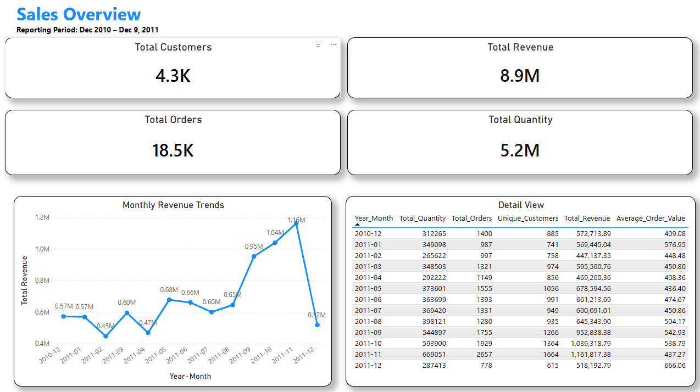
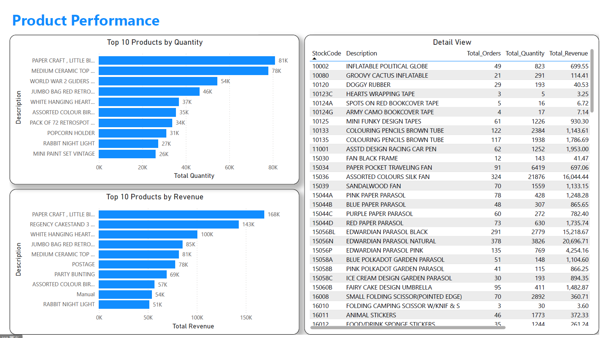
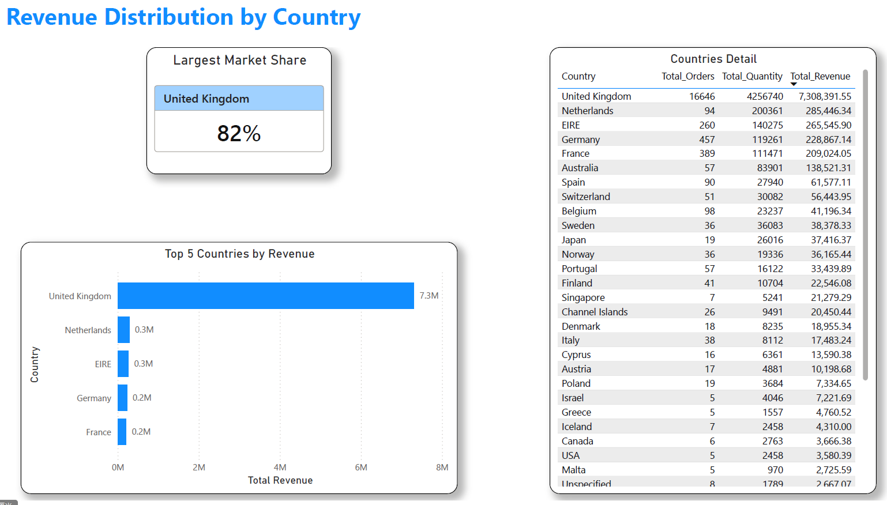
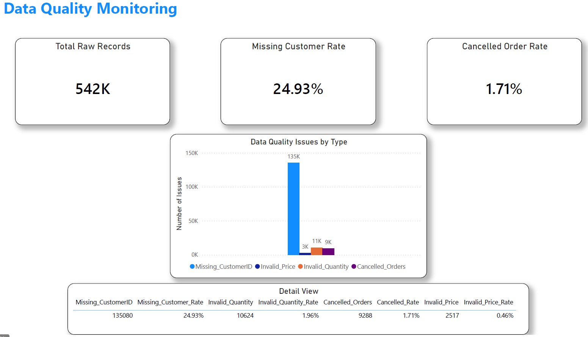

# Retail Sales Performance Dashboard with Data Quality Monitoring

---

## 1. Project Overview

This project analyzes retail transaction data to evaluate revenue performance across products, customers, and geographic markets.

The dataset contains online retail transactions from December 2010 to December 9, 2011 for a UK-based non-store retailer that sells gift items to both individual and wholesale customers.

The analysis focuses on revenue trends, product performance, market distribution, and data quality to support operational reporting and decision-making.

---

## 2. Business Problem

Retail organizations rely on accurate and timely reporting to monitor sales performance, manage inventory demand, and support operational decision-making.

However, raw transaction data often contains data quality issues such as:

- Cancelled transactions
- Missing customer identifiers
- Invalid quantities or prices
- Inconsistent data formats

These issues can lead to unreliable reporting, incorrect performance metrics, and poor operational decisions.

---

## 3. Key Analytical Questions

The project focuses on answering the following business questions:

### 1. How does revenue change over time?

This question evaluates overall business performance by analyzing monthly revenue trends using aggregated sales data.

Data used:

- monthly_sales table  
- Fields: Year, Month, Total_Revenue, Total_Orders, Unique_Customers  

---

### 2. Which products generate the most revenue and sales volume?

This question identifies top-performing products to support inventory planning and product prioritization.

Data used:

- product_performance table  
- Fields: Description, Total_Revenue, Total_Quantity, Total_Orders  

---

### 3. How concentrated is revenue across geographic markets?

This question evaluates market dependency and geographic revenue distribution.

Data used:

- country_performance table  
- Fields: Country, Total_Revenue, Total_Orders  

---

## 4. Dataset

### Dataset Source

Online Retail Dataset (Kaggle)

https://www.kaggle.com/datasets/ulrikthygepedersen/online-retail-dataset

### Description

This dataset contains transactional data from a UK-based online retail store. Each record represents a product purchase, including quantity, price, customer identifier, and country.

The dataset covers transactions from:

December 2010 to December 9, 2011

### Key Fields

- InvoiceNo  
  Invoice number. If this code starts with the letter "C", it indicates a cancelled transaction.

- StockCode  
  Product code uniquely assigned to each item.

- Description  
  Product name.

- Quantity  
  Number of units purchased.

- InvoiceDate  
  Date and time when the transaction was generated.

- UnitPrice  
  Product price per unit.

- CustomerID  
  Unique customer identifier.

- Country  
  Country where the customer resides.

### Dataset Size

Approximately 541,909 transaction records.

---

## 5. Project Objectives

The main objectives of this project are:

- Analyze monthly revenue trends to monitor overall sales performance
- Identify top-performing products based on revenue and sales volume
- Evaluate revenue distribution across geographic markets
- Monitor data quality issues that may affect reporting accuracy

---

## 6. Tools and Technologies

### Data Processing

- Google BigQuery

### Visualization

- Power BI

### Cloud Platform

- Google Cloud Platform

---

## 7. Data Cleaning

To ensure reliable reporting and accurate business metrics, several data quality rules were applied to the raw transaction dataset.

The following records were excluded:

- Cancelled transactions  
  (Invoice numbers starting with "C")

- Invalid quantities  
  (Quantity less than or equal to zero)

- Invalid pricing values  
  (UnitPrice less than or equal to zero)

- Records with missing CustomerID

These rules were implemented to prevent distortion in revenue, demand, and customer-level analysis.

The cleaned dataset is stored in:

orp1001.sales.clean_sales_table

---

## 8. Data Transformation

After data cleaning, additional fields and aggregated tables were created to support reporting and analysis.

### Derived Fields

The following fields were created from the transaction-level dataset:

- Revenue  
  Calculated as Quantity × UnitPrice

- Order Year  
  Extracted from InvoiceDate

- Order Month  
  Extracted from InvoiceDate

These fields enable time-based aggregation and revenue calculations.

### Aggregated Tables

The following summary tables were generated to support dashboard reporting:

- Monthly Sales  
  Aggregated by Year and Month to track revenue and order trends

- Product Performance  
  Aggregated by product to identify top-performing items

- Country Performance  
  Aggregated by country to evaluate geographic revenue distribution

---

## 9. Data Pipeline Architecture

The project follows a structured data workflow similar to production reporting systems.

Raw Sales Data  
↓  
Data Cleaning and Validation  
↓  
Clean Sales Table  
↓  
Aggregated Reporting Tables  
↓  
Power BI Dashboard  

Tables used in reporting:

- clean_sales_table
- monthly_sales
- product_performance
- country_performance
- data_quality_summary

---

## 10. Dashboard Overview

The dashboard provides structured reporting views to monitor sales performance, product demand, geographic distribution, and data quality.

---

### Page 1 — Sales Overview

This page provides a high-level summary of overall business performance.

Key indicators include:

- Total Revenue  
- Total Orders  
- Total Customers  
- Average Order Value  

A monthly revenue trend chart is used to visualize performance changes over time.

---

### Page 2 — Product Performance

This page identifies top-performing products based on revenue and sales volume.

Key elements include:

- Top 10 products by revenue  
- Top 10 products by sales quantity  
- Product-level performance comparison  

---

### Page 3 — Country Performance

This page evaluates revenue distribution across geographic markets.

Key elements include:

- Revenue by country  
- Largest market share  
- Market concentration comparison  

---

### Page 4 — Data Quality Monitoring

This page monitors data quality issues that may affect reporting reliability and transparency.

Key indicators include:

- Total number of raw transaction records
- Rate of missing customer identifiers
- Rate of cancelled transactions

A data quality issue distribution chart is included to compare the scale of different data quality problems.

A detailed table is also provided to present issue counts and rates for validation and reference.

---

## 11. Data Limitations

The dataset contains several limitations that should be considered when interpreting results.

- December 2010 and December 2011 contain partial data
- Approximately 25% of transactions do not include customer identifiers
- The dataset covers a limited historical period of approximately 13 months

These limitations are documented to ensure transparency and responsible interpretation of business metrics.

---

## 12. Findings and Insights

### Revenue Trend

Revenue increased steadily throughout 2011, peaking in November 2011. The decline observed in December 2011 is due to partial data coverage rather than reduced demand.

### Product Performance

A small group of products generates a disproportionately large share of total revenue and sales volume, indicating demand concentration among specific items.

### Geographic Distribution

Revenue is highly concentrated in the United Kingdom, which contributes approximately 82% of total sales. This suggests dependence on the domestic market and potential opportunities for international expansion.

### Data Quality

The largest data quality issue is missing customer identifiers, affecting approximately 25% of records. Other data quality issues occur at relatively low rates.

## 13. Future Improvements

Potential enhancements include:

- Automated scheduled data refresh
- Additional customer behavior analysis
- Expanded product category analysis

---

## 14. Author

Name:  
Runhao Chen
